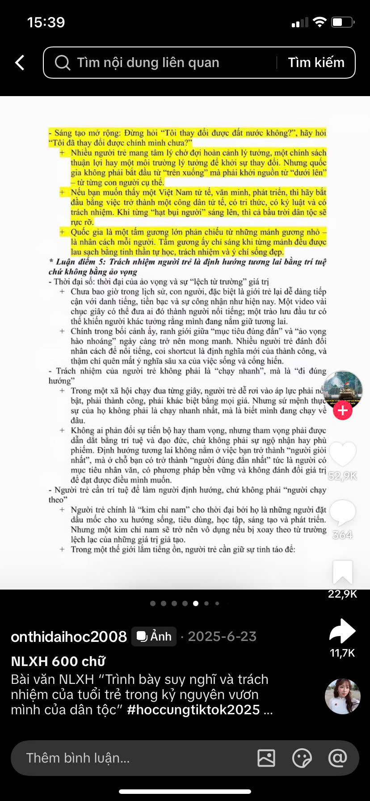
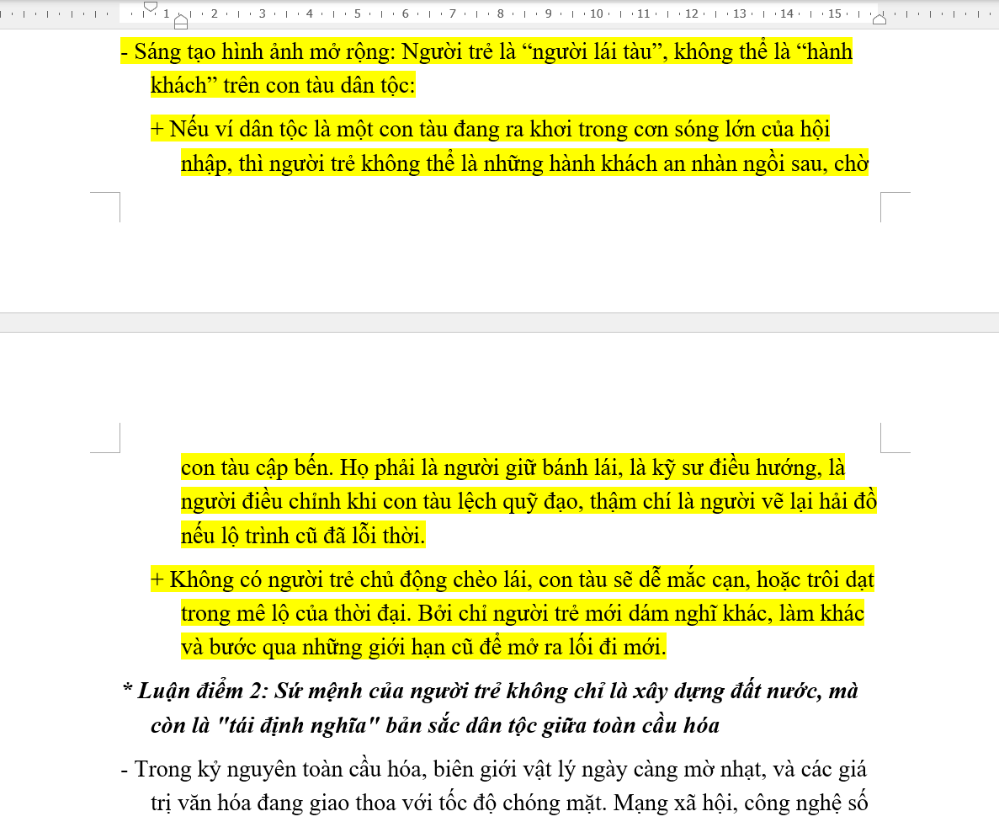

# images_to_docx_vietnamese
Preview:

Convert images or screenshots to Vietnamese docx document format (Times New Roman 14) using Gemini API + npm docx (need API key and npm docx installed).

Convert images (single file / folder / ZIP) of Word-document content
into a real .docx file using:
  1. Google Gemini API  → generates npm-docx JS code
  2. Node.js on your PC → runs the JS → output.docx

Requirements
  pip install google-genai Pillow
  node + npm  (https://nodejs.org)

Usage (use directly with Windows Command Prompt/Windows PowerShell)
  python image_to_docx.py scan.jpg
  python image_to_docx.py screenshots/
  python image_to_docx.py pages.zip
  python image_to_docx.py pages.zip -o results/ -n report.docx --save-js

API key
  Set the GEMINI_API_KEY environment variable (Edit the system environment variables setting), or pass -k YOUR_KEY.

---------------------------------------------------------------------------------------------------------------------------------------------------------------------
Chuyển đổi hình ảnh hoặc ảnh chụp màn hình sang định dạng tài liệu docx tiếng Việt (phông chữ Times New Roman 14) bằng cách sử dụng Gemini API + npm docx (cần khóa API và npm docx).

Chuyển đổi hình ảnh (tệp đơn/thư mục/ZIP) từ nội dung tài liệu Word
thành tệp .docx thực sự bằng cách sử dụng:

1. API Google Gemini → tạo mã JS npm-docx

2. Node.js trên máy tính của bạn → chạy JS → output.docx

Yêu cầu

pip install google-genai Pillow

node + npm (https://nodejs.org)

Cách sử dụng (dùng trực tiếp bằng Windows Command Prompt/Windows PowerShell)

python image_to_docx.py scan.jpg

python image_to_docx.py screenshots/

python image_to_docx.py pages.zip

python image_to_docx.py pages.zip -o results/ -n report.docx --save-js

Khóa API

Đặt biến environment variable GEMINI_API_KEY (cài đặt Edit the system environment variables) hoặc sử dụng trực tiếp với -k YOUR_KEY.
